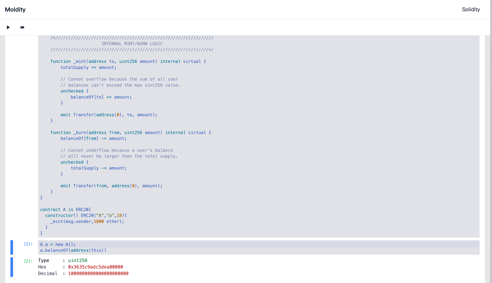

# Modity

Modity is a browser-based Jupyter Notebook-like environment for Solidity, providing an interactive development experience specifically for writing and testing smart contracts. Additionally, Modity offers the capability to interact with EVM-compatible public blockchains, allowing developers to write, test, and deploy smart contracts directly in their web browser.

> [!IMPORTANT]
> Modity is currently under heavy development.

## Features

- Smart contract editing and compilation
- Real-time code execution
- Variable inspection and result display
- Interactive code snippet management
- Solidity syntax highlighting
- Error handling and display
- Integration with EVM-compatible public blockchains

## Tech Stack

- React
- TypeScript
- Vite
- Tailwind CSS
- Jotai (State Management)
- Solidity (Smart Contract Language)
- Bun (Runtime)

## Development

1. Clone the repository
2. Install dependencies: `bun install`
3. Start the development server: `bun run dev`

## Build

Run `bun run build` to create a production build.

## Features (WIP)

- [x] Fragment Runtime
- Notebook
  - [ ] Drag & Drop
  - [X] Running Index
  - [x] Variable Inspection
  - [x] Result Display
  - [ ] Code Snippet Management
  - [ ] Error Handling
  - [ ] Integration with EVM-compatible public blockchains
  - [ ] Notebook Sharing (Export, Import)
  - [ ] Notebook History (Undo, Redo)
  - [ ] Notebook Template
  - [ ] Memory And Stack Inspection (WIP)
  - [ ] Bytecode Inspection
  - [ ] Assembly Inspection
  - [ ] Call Tree Inspection
  - [ ] Gas Usage
  - [ ] Storage Inspection
  - [ ] Event Inspection
  - [ ] Fragment Debugger
- VM
  - [ ] VM Fork Network
  - [x] VM Execution Result
  - [ ] VM cheat codes (for compatible foundry)
  - [ ] VM Debugger
  - [ ] VM Execution Trace
  - [ ] VM Human-readable variables analysis
  - [ ] VM Log Analysis
- Interfaces
  - [ ] Connect to Wallet
  - [ ] Save & Load
  - [ ] Open Github Gist or raw Github URL
  - [x] Fold and unfold CodeFragment
- [ ] VSCode Extension

## License

For license information, please refer to the [LICENSE](./LICENSE) file.